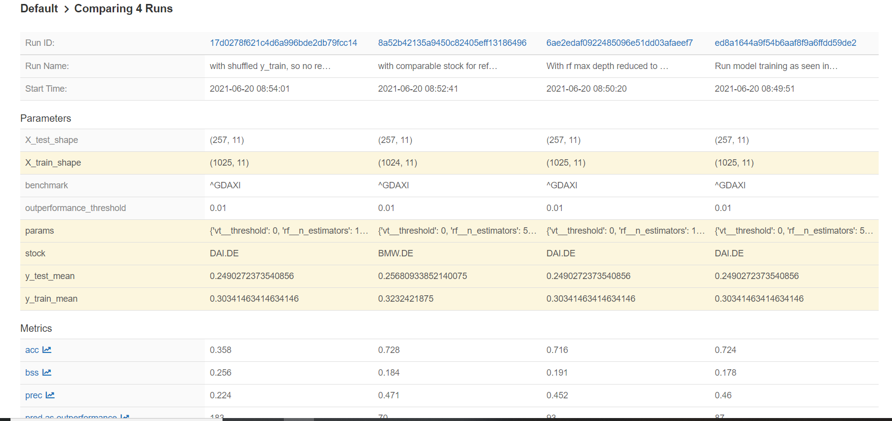

# Predict stock outperformance of benchmark index
Simple machine learning pipeline for building a model that predicts outperformance of a given stock to a benchmark index.

## Approach

### Refinement of task
The aim is to predict whether a particular stock will outperform an associated market index on a weekly basis by a configurable amount of x% (I implemented this as percentage points).

These parameters (stock, index, x% outperformance) can be set in the configuration file `config.json`. 

### Data
The data is downloaded from yahoo finance using their Python API and based on daily ticker information.
I did not put any effort into which stock or index to pick, and hence consider this out of scope for now.

For most parts I have been using the DAX `^GDAXI` performance index, DAIMLER  `DAI.DE` as stock and an outperformance threshold of 2%.

### Target variable definition & feature engineering

#### Target variable
Instead of going for a regression approach, I decided to model this as a binary classification taskwith the target being outperformance by x% (`True`) or not (`False`). This is more closely aligned with a potential decision that may be made based on the models output: To overweigh this particular stock or not in the portfolio.
To calculate this in the training data, I picked the median between daily highs and lows of the stock price, assuming that this will be a price at which it is possible to buy or sell the stock, which may not be the case when only closing prices are considered. I did not consider any transaction costs such as potential fees, taxes or market moving effects. 
Returns are then calculated on a weekly basis, i.e. Monday to Friday. You could also do this as a 7-days difference, but that may make overfitting even more likely as many data points in the training data would overlap.

#### Features
I presumed a careful (pre-)selection of potential features is out of scope for now (+ my spare time is on a budget at the moment...).
The features I engineered resemble a momentum based trading strategy and hence are rolling means and standard deviationds of stock prices, index "prices", and their differences. I also added some boolean features indiciting if a stock splitor dividend payment happens during the period.

I have wrapped all data download and feature engineering in convenient functions, you can find these in `src/data_load_and_feature_engineering.py`

### Data Analysis
I would typically do some data analysis before building a model. As I am not expecting to build a reasonable model here, I skipped this step. Typically, i would also choose a model or a selection of models to consider for the task based on the analysis. Here, I simply opted for a random forest.

### Modeling

Before modeling, I split the time series data into training and testing sets (using a configurable test set size in the configuration file), using the latest 20% of the time series as test set. Hence I assume, that there is some pattern in the previous years that will still hold for next years.

At the moment, feature selection is only implemented as dropping features without any variance, but in a real project this is where I would implement it.

I implemented a scikit-learn pipeline for some exemplary hyperparameter tuning on the training set. I did not spend much time on this part and went with standard best practice for machine learning solutions (randomized search on expanding time series splits of the train set). Then, a model with the identifiedbest parameters is trained on the entire training setand used for predictions on the test set for performance evaluation. I am using the `predict_proba` function, as this gves me far more information than just labels. For a trading strategy, this could also imply the level of certainity for the advised decision.  
To train a model, run `main_training.py` in the root folder of the project.
This model and key parameters and metrics are logged to mlflow.
AsI am not having a SQL-database on my laptop, model registration is not as convenient as it usually is with MLflow and I am storing the model with joblib as well (and by model I mean the sklearn pipeline).

## Evaluation

For evaluation I am using the MLflow tracking service. The UI can be started by running `mlflow ui` in a python terminal or `!mlflow ui` in an interactive ipyhton session, then open the provided address in your browser.

There you can compare different models or model runs, as in this snapshot:

In particular, I wanted to look into overfitting. The most important aspect here, in my opinion, is not any technical metric, but to make sure that you are not tricking yourself by implementing knowledge you can only have in hindsight. An example would be to make changes on hyperparameters after looking at the test set performance metrics (In that regard I am being a poor rolemodel in this assignment, comparing models on test set metrics).

The name of each run indicates what I have varied in each run.
First, I have used the pipeline as-is as my best-guess model. 
Here, I am mainly accessing precision and recall. I selected a model, that scores well on fbeta with an overweight on precision (beta=0.5), as I believe that this metric is mre important for this use case. The default action would probably be to buy the index, as it is less risky compared to a single stock.
So, precision, and hence the expectation of actually outperforming the index, needs to be quite high so that it is worth the risk.
I also like looking at the brier score because it takes the predicted pobabilites into account and not just the labels.
Regarding overfitting, you can see a gap between training and test set  metrics, which is an indication of overfitting.

To apporach this issue, I reduced the maximum depth of the trees in the second run.
Here you can see, that training traing and test set metrics are overall better aligned, whereas the overall performance on the test set does not really look worse. Hence I would prefer this model to the first on. 

To get a better understanding of whether I can trust the model based on these runs, I shuffled the training data labels, to have a complete random model, which should exhibit zero information, as a reference.
This model scores drastically worse on all metrics. So the first two models may be not entirely useless.

Lastly, I have built model with the same specifiations for a similar time series (`BMW.DE`) to see if this model in general is applicable fr this type of time series. You could also use a model entirely trained on `DAI.DE` data for this, if you have reason to believe (what I do not have in this case) that it will work for similar time series.
Assessing the performance, this model scoressimilar to the first two ones. This could be an indication of the strategy/features used may work.

Overall, for evey model the precision is below 50 %, so that you should expect not meeting the desired outperformance in the majority of weeks. If the outperformance threshold is set reasonably, then I would not use a trading strategy based on these results.

## Going forward

To translate this into a trading strategy, further technical and business issues need to be addressed.

From a business and data science view, further checks for assumptions, concept drift, etc. have to be implemented. At the moment the model doesnot even check for the entire test set length whether it is performing as good as expected!
In addition, the certainity of machine learning predictions has to be assessed. 
Also, correlations within the entire portfolio and corresponding risks have to be checked. 

On the technical side, an inference (micro-)service as outlined in my `ml-blueprint-arch` repository could be useful. This would also include e.g. automatic checks for dividend payout dates, as the are not used as a lagged feature n the model and hence have to be known beforehand.
Additionally, model versioning could be refined and data versioning is also recommended in production use.

## Setup & environment
For this project I have been using a conda environment, specified as
`conda create -n example_env python=3.8.10`,\
activated with
`conda activate blueprint`,\
then `cd` to the root folder of your project and installed all requirements with 
`pip install -r requirements.txt`.
Other environement shou also work as long as the runtime is the same as well as all mentioned dependencies are installed.